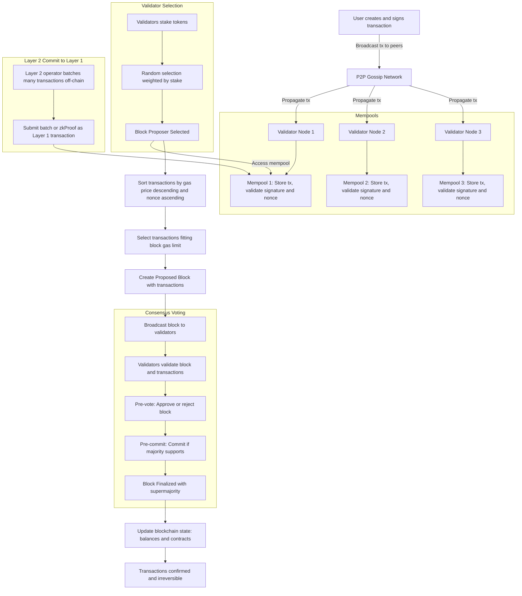

# Transaction Handling in a Proof of Stake (PoS) Blockchain

## 1. Transaction Broadcast in PoS Network

- A user creates and signs a transaction using their private key.
- The signed transaction is broadcasted to the user’s connected peers in the P2P network.
- These peers validate the transaction’s syntax and signature, then propagate it further to their connected peers.
- This gossip-based propagation continues until most or all validators receive the transaction.
- Each validator maintains a **mempool** containing all pending transactions.

---

## 2. Validators and Block Proposal Selection

- Validators are participants who have staked tokens as collateral.
- The PoS consensus protocol selects a **block proposer (leader)** for each new block.
- Selection is often random but weighted by the amount of stake held by validators.
- The chosen proposer creates a new block with a selection of transactions from their mempool.

---

## 3. Transaction Sorting in Validator Mempools

Validators sort transactions to maximize block rewards and maintain transaction order:

- Transactions are sorted by **gas price (fee per gas unit)** in descending order to prioritize the most profitable ones.
- For transactions originating from the same account, they are sorted by **nonce in ascending order** to ensure correct execution order.
- The proposer selects transactions fitting within the block’s **gas limit** or size limit.

---

## 4. Block Proposal and Consensus Process

- The proposer packages the selected transactions into a block and broadcasts it to all validators.
- Validators independently validate the block’s transactions and state transitions.
- Validators participate in a multi-step voting process, typically including:
  - **Pre-vote**: Validators signal approval or rejection of the proposed block.
  - **Pre-commit**: Validators commit to the block if a supermajority supports it.
- Once a supermajority (e.g., > 2/3 of stake-weighted votes) is reached, the block is **finalized** and appended to the canonical blockchain.

---

## 5. Transaction Confirmation and State Update

- Transactions within a finalized block are considered **confirmed** and irreversible.
- The blockchain state (account balances, smart contract states) is updated accordingly.
- Finality in PoS is often **instant**, meaning finalized blocks cannot be reverted without severe penalties (e.g., slashing).

---

## 6. Layer 2 Interaction with PoS Layer 1

- Layer 2 solutions (e.g., zkRollups, Optimistic Rollups) batch multiple transactions off-chain.
- The Layer 2 operator submits proofs or transaction batch summaries to the Layer 1 mempool as special transactions.
- PoS validators treat these submissions like any other transaction:
  - Included in blocks based on gas price and proposer selection.
  - Validated and finalized through the PoS consensus mechanism.
- Layer 1 finality ensures Layer 2 state updates are secured on-chain.

---

## Summary Table

| Stage                | Description                                                |
|----------------------|------------------------------------------------------------|
| Transaction broadcast| User tx propagated via P2P gossip network                   |
| Validator selection  | Proposer chosen randomly, weighted by stake                 |
| Mempool sorting      | Sort txs by gas price desc, nonce ascending per account    |
| Tx selection         | Select highest paying, ordered txs fitting block gas limit  |
| Consensus voting     | Validators pre-vote, pre-commit; supermajority finalizes   |
| Finality             | Instant finality ensures block and txs cannot be reverted  |
| Layer 2 commit       | L2 batches submitted as txs to Layer 1, finalized by PoS   |

---

This process ensures efficient, secure transaction processing with fair validator participation and rapid finality on PoS blockchains.

