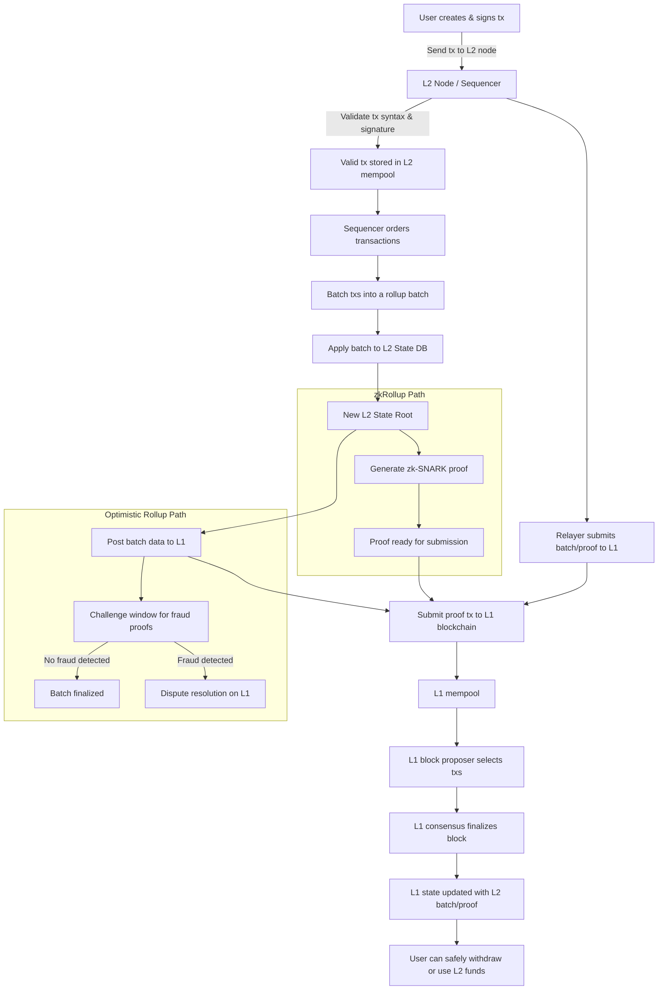

# Layer 2 to Layer 1 Transaction Flow and State Commitment

## Overview

Layer 2 (L2) solutions such as zkRollups and Optimistic Rollups help scale blockchain networks by processing transactions off-chain and submitting succinct proofs or batch data to Layer 1 (L1). This allows high throughput and low gas fees while maintaining security through L1’s consensus.

---

## Key Concepts

| Component           | Description                                                                                       |
|---------------------|---------------------------------------------------------------------------------------------------|
| User                | Sends signed transactions to the Layer 2 network.                                                |
| Layer 2 Node / Sequencer | Collects, validates, orders transactions, and updates the Layer 2 off-chain state.              |
| Layer 2 State Root  | A cryptographic commitment (e.g., Merkle root) representing the entire Layer 2 state after a batch of txs. |
| zk-SNARK Proof      | A succinct zero-knowledge proof certifying correctness of the batch execution (zkRollups).       |
| Batch Data          | Transaction calldata or state roots posted on L1 in optimistic rollups, subject to fraud challenge.|
| Layer 1 Blockchain  | The final settlement layer that stores proofs or batch data and finalizes the L2 state commitment.|
| Fraud Proof System  | A mechanism to challenge fraudulent batches in optimistic rollups during a challenge period.      |
| Relayer             | (Optional) Node responsible for submitting batch data or proofs to Layer 1.                       |

---

## Detailed Transaction Flow

### 1. User Sends Transaction to Layer 2

- User creates and signs a transaction.
- Transaction is submitted to a Layer 2 node (sequencer).

### 2. Layer 2 Node Processes Transactions

- Validates transaction syntax and signature.
- Stores valid transactions in the Layer 2 mempool.
- Orders transactions and batches them.

### 3. Layer 2 State Update

- Applies batch of transactions to Layer 2 off-chain state database.
- Computes a new Layer 2 state root (e.g., Merkle root) representing updated balances and contracts.

### 4. Proof or Batch Submission to Layer 1

- **zkRollups** generate a zk-SNARK proof proving batch correctness, submitting it along with the new state root.
- **Optimistic Rollups** submit the batch data or new state root optimistically without proof, starting a challenge window.

### 5. Layer 1 Consensus

- Layer 1 validators include the proof or batch data in blocks through Proof-of-Stake consensus.
- Once finalized, the Layer 1 chain records the Layer 2 state commitment.

### 6. Post-Submission

- Off-chain Layer 2 state continues to evolve.
- If challenged, fraud proofs are resolved on Layer 1 (Optimistic Rollups).
- Upon finalization, users can safely withdraw funds or transact based on Layer 1 committed state.

---

## What Changes in Layer 2 State When Submitting to Layer 1?

| Stage                     | Layer 2 State Change                                       | Layer 1 State Change                        |
|---------------------------|------------------------------------------------------------|---------------------------------------------|
| Before submission          | Layer 2 state updated locally with processed transactions | No change                                   |
| Submission to Layer 1      | Commit new state root (proof or batch) to Layer 1         | Stores proof or batch data as commitment    |
| After challenge window     | State root finalized if no fraud detected                  | Marks batch as canonical on Layer 1         |

- **Token balances and contract states remain on Layer 2 nodes**; Layer 1 only stores **proofs or cryptographic commitments** to the Layer 2 state.
- This design allows **scalability** and **security** without burdening Layer 1 with large state data.

---

## Layer 2 Nodes

- Layer 2 solutions run their own **network of nodes** (sequencers, validators, provers).
- These nodes maintain the off-chain state, order transactions, and generate proofs or batches.
- They interact with Layer 1 by submitting proofs or batches to anchor Layer 2 state on-chain.

---

## Mermaid Diagram: Layer 2 Transaction to Layer 1 State Commitment

