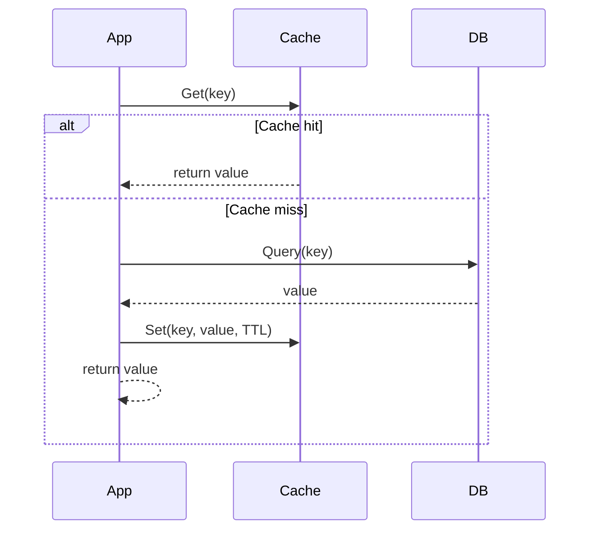
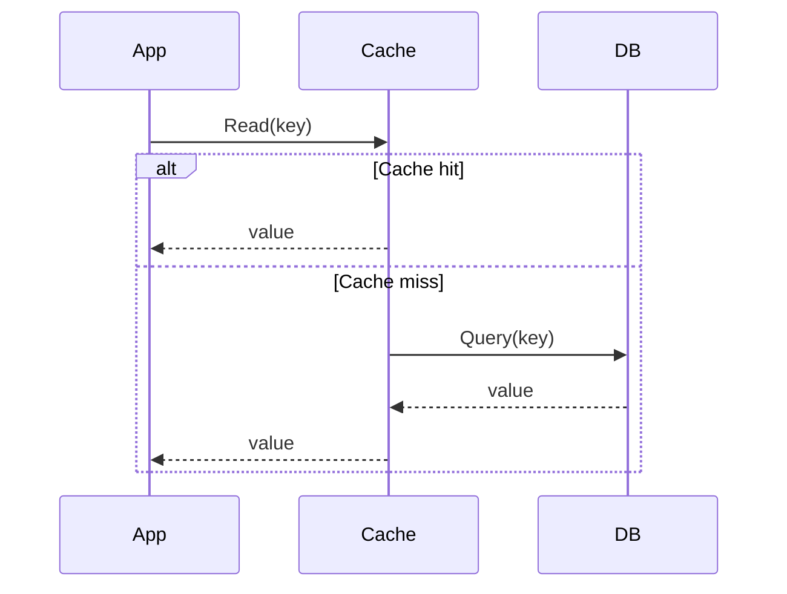
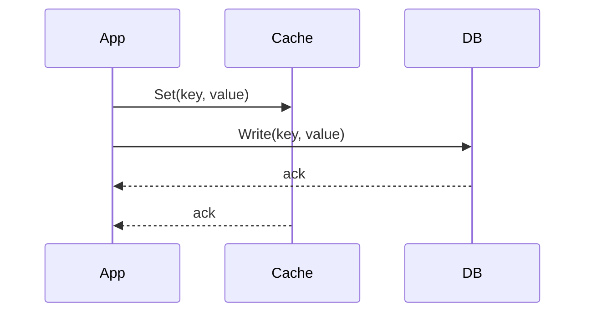
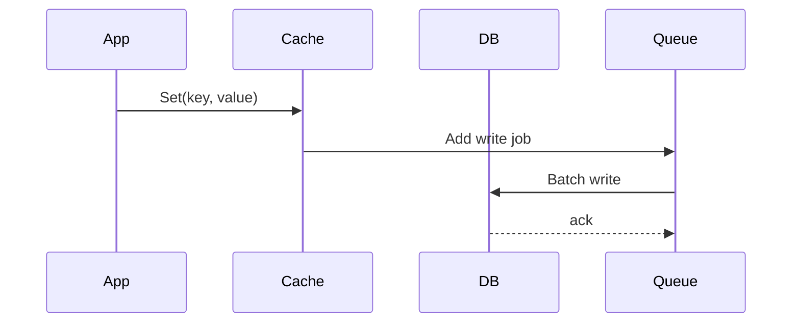

# Caching Strategies Overview

## 1. Cache Aside (Lazy Loading)

**How it works:**
- App requests data.
- Cache checks if the key exists.
  - If found → return immediately.
  - If not → fetch from DB → store in cache → return.

**Advantages:**
- Saves cache space for unused data.
- Reduces DB load for frequently accessed data.

**Disadvantages:**
- First access is slow.
- Risk of "cache miss storm" with multiple simultaneous requests for the same key.

**When to use:**
- Data is read more than written.
- Real-time data is not critical.
- Examples: e-commerce product pages, blog pages.

**Sequence Diagram:**

## 2. Read Through

**How it works:**
- App always reads from cache.
- If cache misses → cache fetches from DB → returns to app.

**Advantages:**
- App doesn't handle cache miss logic.
- Cache manages TTL and refresh.

**Disadvantages:**
- Cache layer is more complex.
- Dependency on cache for DB access.

**When to use:**
- Separate caching logic from the application.
- Fast data synchronization on cache miss.

**Sequence Diagram:**

## 3. Write Through

**How it works:**
- App writes to both cache and DB simultaneously.
- Cache always holds the latest data.

**Advantages:**
- Fast reads, always consistent.
- Reduces cache misses.

**Disadvantages:**
- Slower writes (must write to two places).
- Cache may store rarely used data.

**When to use:**
- Data needs immediate synchronization between cache and DB.
- Examples: shopping cart, user profile updates.

**Sequence Diagram:**

## 4. Write Behind (Write Back)

**How it works:**
- App writes to cache first.
- Cache asynchronously writes to DB (often via a queue for batch writes).

**Advantages:**
- Fast writes, reduced DB load.
- Ideal for data written multiple times before reading.

**Disadvantages:**
- Risk of data loss if cache crashes before syncing to DB.
- DB data may be delayed.

**When to use:**
- Logging, analytics, view counters.
- Tasks not requiring immediate DB synchronization.

**Sequence Diagram:**

## 5. Quick Comparison

| Strategy       | Read                          | Write                              | Data Synchronization         | Complexity |
|----------------|-------------------------------|------------------------------------|------------------------------|------------|
| Cache Aside    | Read from cache, miss → DB    | Write to DB, may invalidate cache  | Not auto-synced              | Low        |
| Read Through   | Always read from cache        | Depends on write strategy          | Cache fetches DB on miss     | Medium     |
| Write Through  | Write to cache & DB           | Slower writes                      | Always synced                | Medium     |
| Write Behind   | Write to cache, DB later      | Fast writes                        | DB may lag                   | High       |
