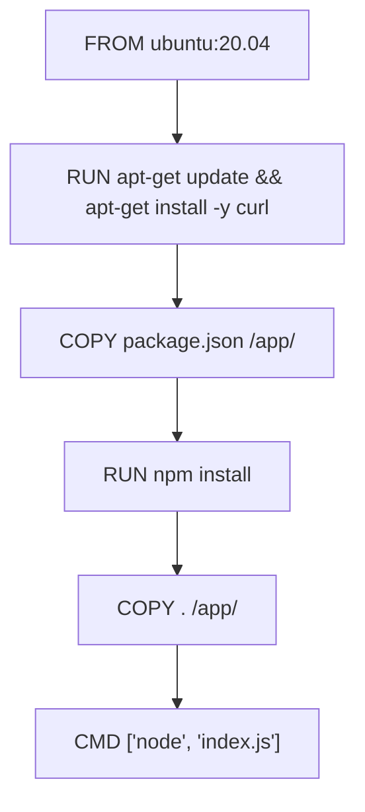
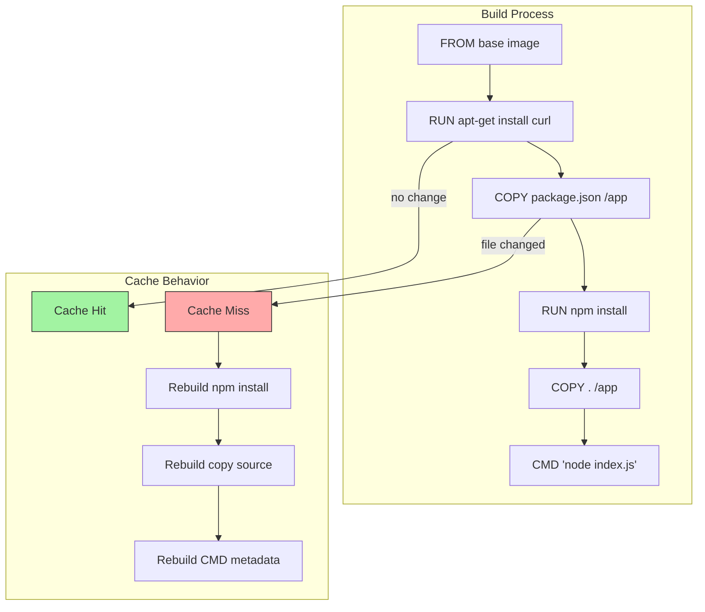
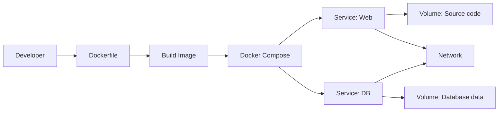
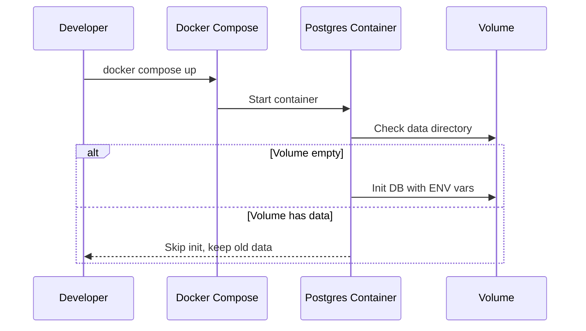

# 📦 Docker – Tổng hợp kiến thức & Biểu đồ trực quan

## 1. Docker Instructions & Layer Structure

### Các instruction phổ biến
| Instruction | Vai trò | Ảnh hưởng đến cache & layer |
|-------------|---------|-----------------------------|
| `FROM` | Base image | Thay đổi → build lại toàn bộ |
| `RUN` | Chạy lệnh trong build | Tạo layer mới, thay đổi → mất cache sau đó |
| `COPY` / `ADD` | Copy file vào image | File thay đổi → mất cache sau đó |
| `ENV` | Set biến môi trường | Metadata layer |
| `EXPOSE` | Gợi ý cổng chạy | Không ảnh hưởng runtime trực tiếp |
| `CMD` / `ENTRYPOINT` | Lệnh mặc định khi chạy container | Không tạo layer mới |
| `WORKDIR` | Đặt thư mục làm việc | Metadata layer |
| `VOLUME` | Khai báo volume | Metadata, runtime mount quyết định |

**Insight**:
- Đặt lệnh ít thay đổi ở trên (cài package OS).
- Lệnh thay đổi thường xuyên (`COPY . .`, `RUN npm install`) để xuống dưới để tối ưu cache.

---

### Biểu đồ Layer Build


---

## 2. Docker Cache Mechanism

### Nguyên tắc:
- Docker build dừng cache từ layer thay đổi → build lại toàn bộ layer sau.
- Tận dụng cache bằng cách copy file phụ thuộc (package.json) trước khi copy toàn bộ code.

### Biểu đồ Cache Behavior


---

## 3. Docker Multi-stage Build

**Ví dụ**:
```dockerfile
# Stage 1: Build
FROM node:18 as builder
WORKDIR /app
COPY package*.json .
RUN npm install
COPY . .
RUN npm run build

# Stage 2: Runtime
FROM node:18-slim
WORKDIR /app
COPY --from=builder /app/dist ./dist
COPY package*.json .
RUN npm install --omit=dev
CMD ["node", "dist/index.js"]
```

**Lợi ích**:
- Giảm kích thước image.
- Loại bỏ build tools trong runtime → an toàn hơn.

---

## 4. Docker Compose

**Ví dụ**:
```yaml
version: "3.9"
services:
  web:
    build: .
    ports:
      - "3000:3000"
    env_file: .env
    volumes:
      - ./src:/app/src
  db:
    image: postgres:15
    environment:
      POSTGRES_PASSWORD: example
    volumes:
      - db_data:/var/lib/postgresql/data

volumes:
  db_data:
```

---

### Biểu đồ Compose Flow


---

## 5. Reload Container Khi Thay Đổi

| Trường hợp thay đổi | Cách reload |
|---------------------|-------------|
| Thay `.env` | `docker compose up -d --build` |
| Install package mới | `docker compose build` rồi `up` |
| Thay config DB | Restart container, rebuild nếu config trong env |
| Code thay đổi | Bind-mount code + hot reload nếu app hỗ trợ |
| Volume data thay đổi | Restart container, không rebuild image |

---

## 6. Vấn đề đổi ENV DB nhưng volume giữ nguyên

### Cơ chế:
- Lần đầu tạo volume: DB init theo ENV.
- Sau khi volume có data → ENV không còn tác dụng khởi tạo lại.
- Đổi password/user/schema chỉ áp dụng nếu xóa volume.

### Biểu đồ DB Init Behavior


### Giải pháp:
```bash
docker compose down -v  # Xoá container + volume
docker compose up -d    # Init DB lại với ENV mới
```
⚠ Xóa volume sẽ mất toàn bộ dữ liệu.

---

## 7. Best Practices
- Giảm số layer bằng cách gộp lệnh `RUN`.
- Sử dụng `.dockerignore` để tránh copy file không cần thiết.
- Multi-stage build để tối ưu kích thước image.
- Volume cho dữ liệu DB, bind-mount cho code dev.
- Không hardcode config → dùng ENV hoặc secret manager.
