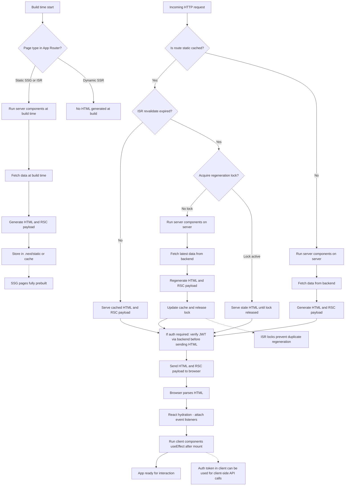

```mermaid 
flowchart TD
    %% Build Phase
    A[Build time start] --> B{Page type in App Router?}

    %% --- SSG / ISR Build ---
    B -->|Static SSG or ISR| B1[Run server components at build time]
    B1 --> B2[Fetch data at build time]
    B2 --> B3[Generate HTML and RSC payload]
    B3 --> B4[Store in .next/static or cache]

    %% --- SSR Skip Build ---
    B -->|Dynamic SSR| B5[No HTML generated at build]

    %% Request Phase
    R1[Incoming HTTP request] --> R2{Is route static cached?}

    %% Cached route
    R2 -->|Yes| R3{ISR revalidate expired?}
    R3 -->|No| R4[Serve cached HTML and RSC payload]
    R3 -->|Yes| R5{Acquire regeneration lock?}
    R5 -->|No lock| R6[Run server components on server]
    R6 --> R7[Fetch latest data from backend]
    R7 --> R8[Regenerate HTML and RSC payload]
    R8 --> R9[Update cache and release lock]
    R5 -->|Lock active| R10[Serve stale HTML until lock released]

    %% Dynamic route (SSR)
    R2 -->|No| D1[Run server components on server]
    D1 --> D2[Fetch data from backend]
    D2 --> D3[Generate HTML and RSC payload]

    %% Auth Check
    R4 --> A1[If auth required: verify JWT via backend before sending HTML]
    R9 --> A1
    R10 --> A1
    D3 --> A1

    %% Response to browser
    A1 --> H1[Send HTML and RSC payload to browser]

    %% Hydration Phase
    H1 --> H2[Browser parses HTML]
    H2 --> H3[React hydration - attach event listeners]
    H3 --> H4[Run client components useEffect after mount]
    H4 --> H5[App ready for interaction]

    %% Notes
    B4 -.-> N1[SSG pages fully prebuilt]
    R9 -.-> N2[ISR locks prevent duplicate regeneration]
    H4 -.-> N3[Auth token in client can be used for client-side API calls]

```
