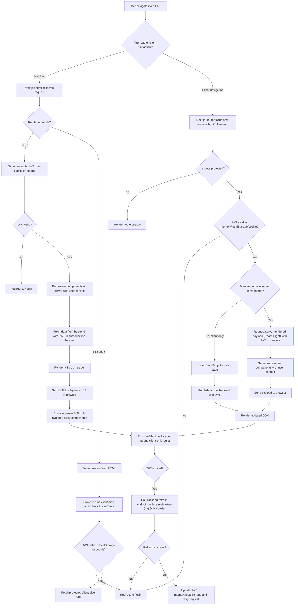

```mermaid
flowchart TD
    %% Entry
    A1["User navigates to a URL"] --> B1{"First load or client navigation?"}

    %% First Load Path
    B1 -->|First load| C1["Next.js server receives request"]
    C1 --> D1{"Rendering mode?"}

    %% SSR path with Auth
    D1 -->|SSR| E1["Server extracts JWT from cookie or header"]
    E1 --> F1{"JWT valid?"}
    F1 -->|No| F2["Redirect to /login"]
    F1 -->|Yes| G1["Run server components on server with user context"]
    G1 --> H1["Fetch data from backend with JWT in Authorization header"]
    H1 --> I1["Render HTML on server"]
    I1 --> J1["Send HTML + hydration JS to browser"]
    J1 --> K1["Browser parses HTML & hydrates client components"]
    K1 --> L1["Run useEffect hooks after mount (client-only logic)"]

    %% SSG/ISR path
    D1 -->|SSG/ISR| M1["Serve pre-rendered HTML"]
    M1 --> N1["Browser runs client-side auth check in useEffect"]
    N1 --> O1{"JWT valid in localStorage or cookie?"}
    O1 -->|No| P1["Redirect to /login"]
    O1 -->|Yes| Q1["Fetch protected client-side data"]

    %% Client Navigation Path
    B1 -->|Client navigation| R1["Next.js Router loads new route without full refresh"]
    R1 --> S1{"Is route protected?"}
    S1 -->|No| T1["Render route directly"]
    S1 -->|Yes| U1{"JWT valid in memory/localStorage/cookie?"}
    U1 -->|No| P1
    U1 -->|Yes| V1{"Does route have server components?"}

    %% Client navigation - client only
    V1 -->|No, client-only| W1["Load JavaScript for new page"]
    W1 --> X1["Fetch data from backend with JWT"]
    X1 --> Y1["Render updated DOM"]
    Y1 --> L1

    %% Client navigation - server components
    V1 -->|Yes| Z1["Request server-rendered payload (React Flight) with JWT in headers"]
    Z1 --> AA1["Server runs server components with user context"]
    AA1 --> AB1["Send payload to browser"]
    AB1 --> Y1

    %% Token Refresh
    L1 --> AC1{"JWT expired?"}
    AC1 -->|Yes| AD1["Call backend refresh endpoint with refresh token (httpOnly cookie)"]
    AD1 --> AE1{"Refresh success?"}
    AE1 -->|No| P1
    AE1 -->|Yes| AF1["Update JWT in memory/localStorage and retry request"]

```
