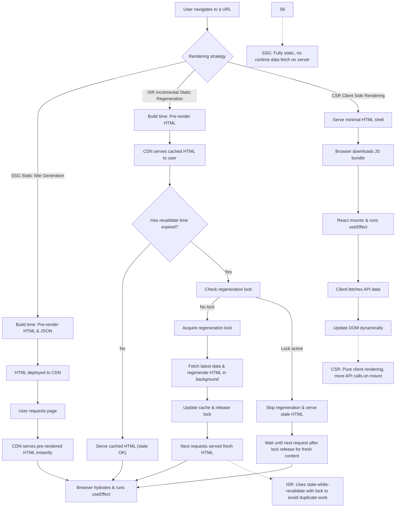

```mermaid
flowchart TD
    %% Main Entry
    A["User navigates to a URL"] --> B{"Rendering strategy"}

    %% --- SSG Path ---
    B -->|SSG Static Site Generation| S1["Build time: Pre-render HTML & JSON"]
    S1 --> S2["HTML deployed to CDN"]
    S2 --> S3["User requests page"]
    S3 --> S4["CDN serves pre-rendered HTML instantly"]
    S4 --> S5["Browser hydrates & runs useEffect"]

    %% --- ISR Path ---
    B -->|ISR Incremental Static Regeneration| I1["Build time: Pre-render HTML"]
    I1 --> I2["CDN serves cached HTML to user"]
    I2 --> I3{"Has revalidate time expired?"}
    I3 -->|No| I4["Serve cached HTML (stale OK)"]
    I3 -->|Yes| I5["Check regeneration lock"]

    %% Locking
    I5 -->|No lock| L1["Acquire regeneration lock"]
    L1 --> L2["Fetch latest data & regenerate HTML in background"]
    L2 --> L3["Update cache & release lock"]
    L3 --> I8["Next requests served fresh HTML"]

    I5 -->|Lock active| L4["Skip regeneration & serve stale HTML"]
    L4 --> I6["Wait until next request after lock release for fresh content"]

    %% Merge hydration
    I4 --> S5
    I8 --> S5
    I6 --> S5

    %% --- CSR Path ---
    B -->|CSR Client Side Rendering| C1["Serve minimal HTML shell"]
    C1 --> C2["Browser downloads JS bundle"]
    C2 --> C3["React mounts & runs useEffect"]
    C3 --> C4["Client fetches API data"]
    C4 --> C5["Update DOM dynamically"]

    %% Notes
    S6 -.-> N1["SSG: Fully static, no runtime data fetch on server"]
    I8 -.-> N2["ISR: Uses stale-while-revalidate with lock to avoid duplicate work"]
    C5 -.-> N3["CSR: Pure client rendering, more API calls on mount"]

```
