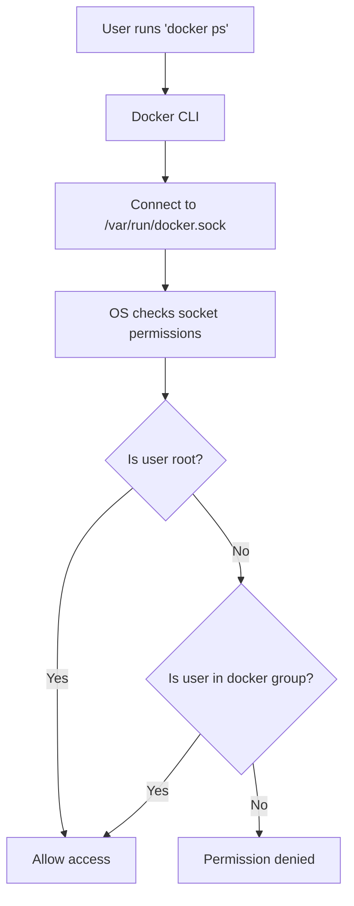
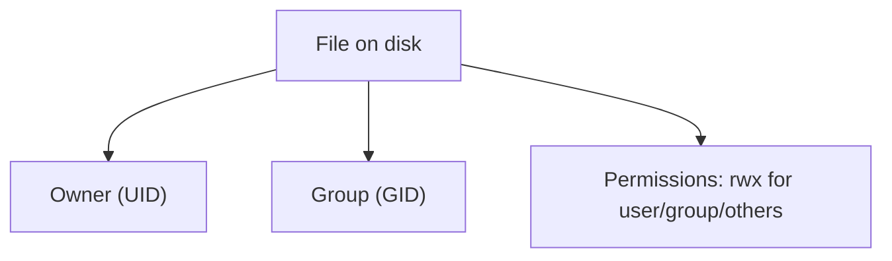

# Linux Users, Groups, Permissions & Docker Access

This document explains **Linux users, groups, file permissions** and how they interact with **Docker**.  
It includes step-by-step commands and diagrams.

---

## 1. Users and Groups

In Linux:
- **User**: Account identified by a **username** and **UID**.
- **Group**: Collection of users identified by a **group name** and **GID**.

### View Users
```bash
cat /etc/passwd
```
Format:
```
username:password_placeholder:UID:GID:comment:home_dir:shell
```

### View Groups
```bash
cat /etc/group
```
Format:
```
groupname:password_placeholder:GID:user_list
```

---

## 2. File Ownership and Permissions

Every file has:
1. **Owner** (user)
2. **Group**
3. **Permissions** for owner, group, others

Check file details:
```bash
ls -l
```
Example:
```
-rw-r--r-- 1 alice devs 1234 Aug 12 myfile.txt
```

---

### Permission Modes
- `4` = read (r)
- `2` = write (w)
- `1` = execute (x)

Numeric example:
```bash
chmod 644 myfile.txt  # rw-r--r--
```

Symbolic example:
```bash
chmod u+x script.sh  # add execute for owner
chmod g-w script.sh  # remove write for group
```

---

## 3. Changing Ownership
```bash
sudo chown bob:devs myfile.txt   # by name
sudo chown 1001:1002 myfile.txt  # by UID/GID
```

---

## 4. UID and GID in Action

```bash
ls -n    # shows UID and GID
```
Example:
```
-rw-r--r-- 1 1000 1000  1234 Aug 12 myfile.txt
```

---

## 5. Docker and Permissions

Docker daemon (`dockerd`) runs as **root** and listens on:
```
/var/run/docker.sock
```
Check:
```bash
ls -l /var/run/docker.sock
```
Example:
```
srw-rw---- 1 root docker 0 Aug 12 10:00 /var/run/docker.sock
```
- Owner: `root`
- Group: `docker`
- Permissions: `rw` for owner and group, none for others.

---

## 6. Why You Need to Add Yourself to `docker` Group

Without being in the `docker` group:
```bash
docker ps
# → permission denied: /var/run/docker.sock
```

After adding:
```bash
sudo usermod -aG docker $USER
```
- `-aG docker` → append group `docker`
- `$USER` → current user

**Log out and back in** to apply changes.

Now:
```bash
docker ps
# Works without sudo
```

---

## 7. Security Warning

Members of the `docker` group can effectively become **root** on the host:
```bash
docker run -v /:/host --rm -it ubuntu bash
chroot /host
```

---

## 8. Mermaid Diagram — File Permission Check



---

## 9. Mermaid Diagram — Linux File Ownership Model



---

## 10. Practice Lab

```bash
# Check your UID and GID
id

# Create test file
touch test.txt

# Set permissions
chmod 640 test.txt

# Change ownership
sudo chown $USER:docker test.txt

# View result
ls -l test.txt
```
