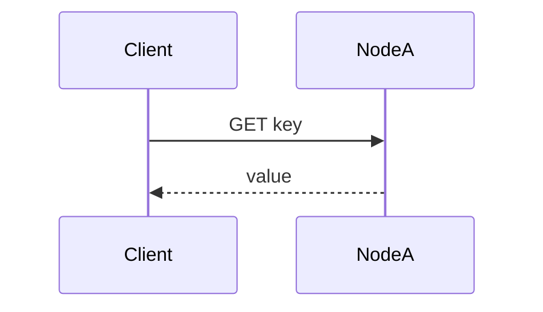
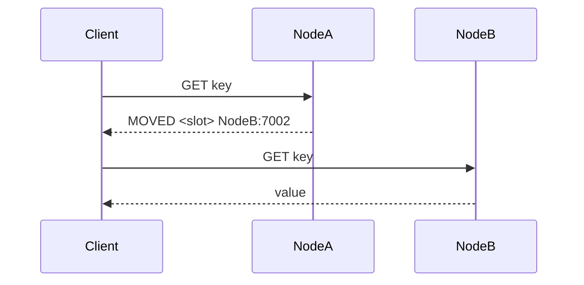
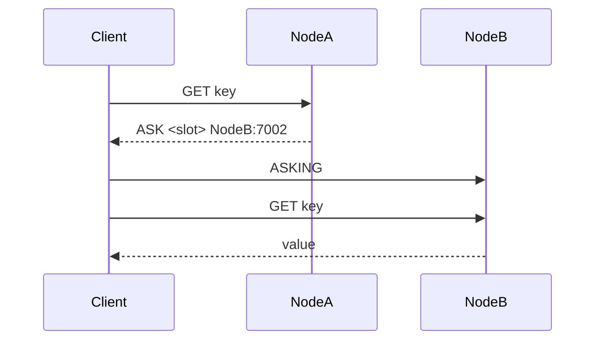
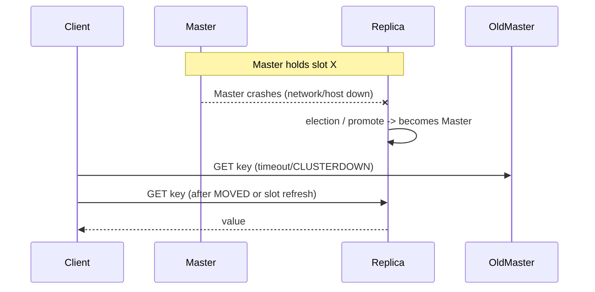
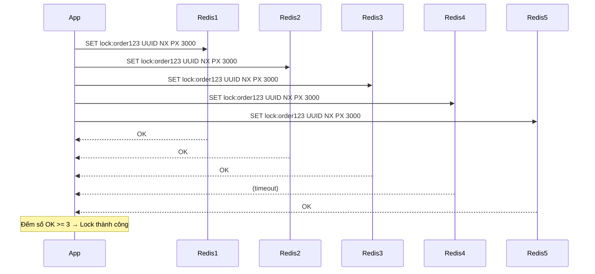

# Redis Cluster — Giải thích chi tiết (in-depth)

> Tài liệu này trình bày sâu về **Redis Cluster**, các tình huống khi client gọi `GET`, cách client (đặc biệt là Node.js) xử lý `MOVED`/`ASK`, khác nhau giữa client phổ thông và **ioredis**, kèm sequence diagram, ví dụ code và best practices.


## 1. Giới thiệu nhanh

Redis Cluster là cách Redis mở rộng theo chiều ngang: chia keyspace thành nhiều phần (slot), gán slot cho từng master node và có replica để đảm bảo high availability. Mục tiêu: tăng throughput, tăng dung lượng lưu trữ và có khả năng failover tự động.

---

## 2. Kiến trúc Redis Cluster — những điểm cần nắm

* **16384 hash slots**. Mỗi key được hash vào 1 trong 16384 slot bằng công thức `CRC16(key) % 16384`.
* **Slot → Master node**: Mỗi slot được gán cho 1 master node. Master có thể có 0..N replica.
* **Replication**: Master data được replicate sang replica. Khi master chết, replica có thể được promote lên làm master (qua cơ chế bầu cử của cluster).
* **Cluster bus & gossip**: Các node trao đổi trạng thái với nhau để phát hiện master down, tiến hành failover.
* **MOVED / ASK**: Hai response quan trọng cho client khi slot mapping thay đổi hoặc đang migrate.
* **Slot migration**: Khi rebalancing (thêm node, remove node, reshard), slot được migrate từ master A → master B — trong thời gian này `ASK` có thể xuất hiện.

**Hạn chế**

* Multi-key operations chỉ an toàn nếu **các key nằm cùng slot**.
* Transaction (MULTI/EXEC) trên nhiều key thuộc khác slot không support.

---

## 3. Các response đặc trưng khi gọi `GET` trong Cluster

* **Normal**: key ở node bạn hỏi → trả giá trị.
* **MOVED**: server trả `MOVED <slot> <host>:<port>` → nghĩa là mapping slot đã ổn định và vĩnh viễn tại node kia. Client nên cập nhật slot cache và retry đến node đích.
* **ASK**: server trả `ASK <slot> <host>:<port>` → nghĩa là slot đang tạm thời migrate; client cần gửi `ASKING` tới node đích rồi retry command, **không** cập nhật slot cache vĩnh viễn.
* **Node down / CLUSTERDOWN**: master chứa slot chết và chưa có failover → client có thể nhận `CLUSTERDOWN` hoặc timeout.
* **READONLY / stale read**: nếu client cấu hình cho phép đọc từ replica (slave) thì có thể đọc dữ liệu chưa kịp replicate → giá trị cũ (replication lag).

---

## 4. Sequence diagrams (Mermaid)

### 4.1 GET — normal



### 4.2 GET → MOVED



### 4.3 GET → ASK (during slot migration)



### 4.4 Failover: master dies → replica promoted



---

## 5. Client-side: cluster-aware vs non-cluster-aware

### Cluster-aware client (recommended)

* Hiểu `MOVED`/`ASK` và tự reroute.
* Có **slot cache** (slot → node mapping) để gửi requests đến đúng node thay vì luôn đi cầu nối.
* Tự động **refresh slot mapping** khi nhận MOVED hoặc theo định kỳ.
* Hỗ trợ pipelining, retry, backoff, đọc từ replica (scaleReads) tuỳ cấu hình.

### Non-cluster-aware client

* Gặp `MOVED`/`ASK` sẽ nhận lỗi text trả về và **phải** implement lại logic: parse response, connect node đích, xử lý `ASKING` nếu cần.
* Không có slot cache → gây overhead nhiều MOVED responses.

### ioredis (tại sao thường dùng cho cluster)

* Matures, robust cluster handling: tự động xử lý `MOVED`/`ASK`, refresh slot cache, hỗ trợ `scaleReads` (read from replica), pipelining, Lua scripts và sentinel/cluster.
* Cung cấp API `new Redis.Cluster([...])` đơn giản.
* Tùy chọn hữu ích: `scaleReads`, `redisOptions`, `clusterRetryStrategy`, `slotsRefreshInterval`.

**Ví dụ ioredis (cluster)**

```js
const Redis = require('ioredis');

const cluster = new Redis.Cluster([
  { host: '127.0.0.1', port: 7000 },
  { host: '127.0.0.1', port: 7001 },
  { host: '127.0.0.1', port: 7002 },
], {
  redisOptions: { maxRetriesPerRequest: 3, connectTimeout: 10000 },
  scaleReads: 'slave', // allow reads from replicas (config)
});

await cluster.set('foo', 'bar');
const v = await cluster.get('foo');
```

### node-redis / `redis` (official client)

* `redis` (v4+) cung cấp API cluster: `createCluster({ rootNodes: [...] })`.
* Đã cải thiện rất nhiều, Promise-based API, nhưng ioredis vẫn thường được ưa chuộng ở các môi trường cluster lớn vì feature-set và maturity.

**Ví dụ node-redis cluster**

```js
const { createCluster } = require('redis');

const cluster = createCluster({
  rootNodes: [
    { url: 'redis://127.0.0.1:7000' },
    { url: 'redis://127.0.0.1:7001' },
  ],
});

await cluster.connect();
await cluster.set('foo', 'bar');
const v = await cluster.get('foo');
```

**So sánh ngắn**

* ioredis: cluster features mạnh, auto-retry, refresh, scaleReads, battle-tested.
* node-redis: official, promise-friendly, gần đây đã bù đắp khoảng cách (v4+), vẫn cần kiểm tra feature gap cho môi trường cụ thể.

---

## 6. Ảnh hưởng đến cache Node.js khi gặp MOVED/ASK

Kịch bản: bạn có 1 cache in-memory (LRU) trong Node.js, fallback đến Redis Cluster trên cache miss.

* Trường hợp **cache hit** (key trong process memory) → không liên quan MOVED/ASK.
* Trường hợp **cache miss** → Node.js client gọi Redis:

  * Nếu client là cluster-aware: client sẽ reroute (mất 1 bước retry khi MOVED/ASK). Latency tăng nhẹ.
  * Nếu client non-cluster-aware: có thể lỗi MOVED hoặc ASK mà app phải parse & reroute → phức tạp.

**Gợi ý**: thêm 1 layer local cache để giảm truy vấn Redis trong giai đoạn re-sharding. Khi rebalancing xảy ra thường xuyên, local cache giúp giảm ảnh hưởng.

---

## 7. Multi-key operations & hash-tag

* **Luật**: multi-key command (MGET, MSET, EVAL, WATCH/MULTI) chỉ hoạt động khi các key nằm trên cùng slot.
* **Hash tag**: đặt phần chung trong `{}` để ép các key vào cùng slot.

  * Ví dụ: `user:{123}:name` và `user:{123}:email` → sẽ nằm cùng slot vì chỉ hash nội dung `123`.
* Nếu không cùng slot, bạn sẽ gặp lỗi `CROSSSLOT Keys in request don't hash to the same slot`.

---

## 8. Distributed Locking

### 8.1 Pattern cơ bản (SET NX PX)

* `SET lockKey token NX PX ttl`

  * NX: chỉ set khi key chưa tồn tại
  * PX ttl: auto expire
* Unlock an toàn: dùng script Lua để kiểm tra token trước khi DEL.

**Release Lua script**

```lua
if redis.call("GET", KEYS[1]) == ARGV[1] then
  return redis.call("DEL", KEYS[1])
else
  return 0
end
```

**ioredis example**

```js
const token = require('crypto').randomUUID();
const ok = await cluster.set(lockKey, token, 'NX', 'PX', 5000);
if (ok !== 'OK') throw new Error('lock failed');

// ... critical section ...

const releaseScript = `
if redis.call("GET", KEYS[1]) == ARGV[1] then
  return redis.call("DEL", KEYS[1])
else
  return 0
end
`;
await cluster.eval(releaseScript, 1, lockKey, token);
```

### 8.2 Redlock (Distributed Lock)
#### 8.2.1 Mục tiêu
Đảm bảo **mutual exclusion** khi nhiều process/instance truy cập chung tài nguyên.

### 8.2.2 Cơ chế

* Chạy N Redis instance (N=5 khuyến nghị).
* Acquire lock: gửi `SET resource value NX PX ttl` gần đồng thời đến tất cả nodes.
* Thành công nếu ≥ (N/2)+1 nodes trả OK.
* Release lock: kiểm tra value trước khi xóa.

### 8.2.3 Tại sao cần value random (UUID)

Tránh unlock nhầm lock của process khác.

### 8.2.4 Sequence Diagram Acquire Lock



### 8.2.5 Code Node.js với ioredis + redlock

```js
import Redis from 'ioredis';
import Redlock from 'redlock';

const clients = [
  new Redis({ host: 'redis1', port: 6379 }),
  new Redis({ host: 'redis2', port: 6379 }),
  new Redis({ host: 'redis3', port: 6379 }),
  new Redis({ host: 'redis4', port: 6379 }),
  new Redis({ host: 'redis5', port: 6379 }),
];

const redlock = new Redlock(clients, {
  retryCount: 3,
  retryDelay: 200,
  retryJitter: 200,
});

(async () => {
  try {
    const lock = await redlock.acquire(['lock:order123'], 3000);
    console.log('Lock acquired!');
    // Xử lý logic độc quyền ở đây
    await lock.release();
    console.log('Lock released!');
  } catch (err) {
    console.error('Failed to acquire lock:', err);
  }
})();
```

## 9. Best practices & production checklist

* **Always use a cluster-aware client** (ioredis hoặc node-redis cluster) for Redis Cluster.
* **Local cache** (LRU) để giảm truy vấn trong giai đoạn re-sharding/migration.
* **Use hash tags** khi cần multi-key transactions.
* **Monitor replication lag** nếu đọc từ replica (scaleReads).
* **Configure timeouts and retry strategies** (connectTimeout, maxRetriesPerRequest, retryStrategy).
* **Test failover**: kiểm tra behavior khi master down, check MOVED/ASK handling.
* **Avoid large keys/pipelines across slots**.
* **Backups & persistence**: bật RDB/AOF theo nhu cầu, test restore.
* **Instrumentation & alerts**: monitor `CLUSTER INFO`, `INFO replication`, latency, memory, eviction events.

---

## 10. Troubleshooting common errors

* `MOVED` spam: client không cache slot mapping hoặc cluster đang liên tục re-shard.
* `ASK` loops: migration chưa hoàn tất hoặc client không thực hiện `ASKING` trước khi retry.
* `READONLY You can't write against a read only replica`: bạn đang gửi write tới replica do mapping cũ; client nên refresh slots.
* `CLUSTERDOWN`: cluster không có đủ masters để phục vụ yêu cầu → kiểm tra health, quorum, failover.

---

## 11. Appendix — useful commands & node snippets

**redis-cli cluster info**

```bash
redis-cli -c -h 127.0.0.1 -p 7000 cluster info
redis-cli -c -h 127.0.0.1 -p 7000 cluster nodes
```

**Check slots of a key**

```bash
# get slot number
python -c "import binascii; print(binascii.crc_hqx(b'foo',0) % 16384)"
# or use redis-cli:
redis-cli CLUSTER KEYSLOT mykey
```


